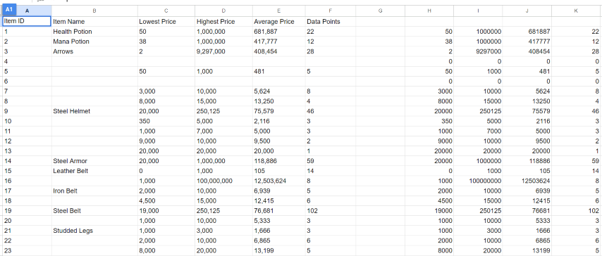

# Rucoy-Bot

## What is this?
This was a program I wrote back in 2019/2020 and spent quite a few months on. It plays the android game Rucoy Online for you by attacking monsters 
and gathering loot. While that may be what the program did, I don't believe it works anymore which is why I'm backing it up here.

I used this program as an opportunity to learn about python, reverse engineering, tcp/ip, multithreading and much more. It works by capturing
data going back and forth between the game and the server and decodes it in real time. All the packets are written in a binary format in the
smallest possible form, which meant it took months of slow trial and error to decode all the different types of packets. The obvious upside
to an approach like this means that regardless of what's shown on the screen, this program always knew exactly what was going on and could react
accordingly. The downside is that after a few updates, if there are new updates that add different packets or change the structure of the data,
then it'll break the ability to comprehend the packets. Also, if encryption is/was ever employed, then functionality would break since a proxy 
to handle the decoding/encoding for https would need to be added. 

This is pretty much the first program I ever wrote in python and I believe anyone looking at the code could tell that pretty quickly. There's
almost no comments, variables aren't named that well, and the file structure is a mess. I'm sure there's more problems than that too, but those
are just the quick ones that come to mind. 

If someone for some reason actually has questions, feel free to contact me. I'm not sure if the game used some library for the way it formatted
its' packets but it might be possible the work I did decoding could be useful to someone. If so, I'd recommend looking in the mitm.py file to
see all the different ways packets were decoded. There's so much more I could write, but I'll leave it here since it probably won't be
practical for anyone.

***While this doesn't have a license, the main reason I never shared this earlier is because I vehemently believe no one should use bots***
***and ruin the gaming experience for others. I only made this into a bot because it seemed like a fun way to see the results of research.***
***This software is for reference and research purposes only.***

### A couple videos taken during development

[Infant Bot](https://youtu.be/YNw9MnpMtjk)

[6 Bots At Once](https://youtu.be/wQcomEtyltk)

## Full Feature List
- Captures and decodes tcp packets in real time
- Displays translated packets in GUI
- If client_secret.json is provided, it can send email/text updates about your bot
- If a username/password is provided, then it can also update a google spreadsheet with
  names/prices of current items in the market. [Example](https://docs.google.com/spreadsheets/d/1v_wNvDZnZRX1W4U3LFYBLACNV_8xEE8V0BF4y-tA698/edit?usp=sharing)
- Connect to a rucoyonline.com api and get current player counts for every server before bot even starts.
- Track your xp in actual numbers instead of bars and see it go up in real time.
- Prioritize XP, XP + Gold, or XP + Gold + Loot while botting.
- Can open Rucoy Bot several times and each one can run a bot as long as each one uses a different server (ie. NA1 and Asia 1)
- Add levels to player names in the translated packets in real time
- Get an email/text if someone messages you while botting
- Focus bot on specific monsters like Vampires to ensure maximum XP gain
- Extracts savefile.xml to Rucoy Bot's directory so local accounts can be saved.
- Provides a recap with screenshots of your in game stats when done training.

## How to Use *(Not Tested!)*
There is an installer for a packaged version in the `Rucoy Bot 1.3.1.zip` file, but please use at your own risk since it's been years since it's
been tested or used. Please note the only reason Rucoy Bot needs Administer level privelages is since it is capturing network data. You can 
confirm in the code though that it only looks at packets going to or from port 4000.

## Pictures
### Spreadsheet

### Text Updates

### Raw Packet

### Decoded Packet

